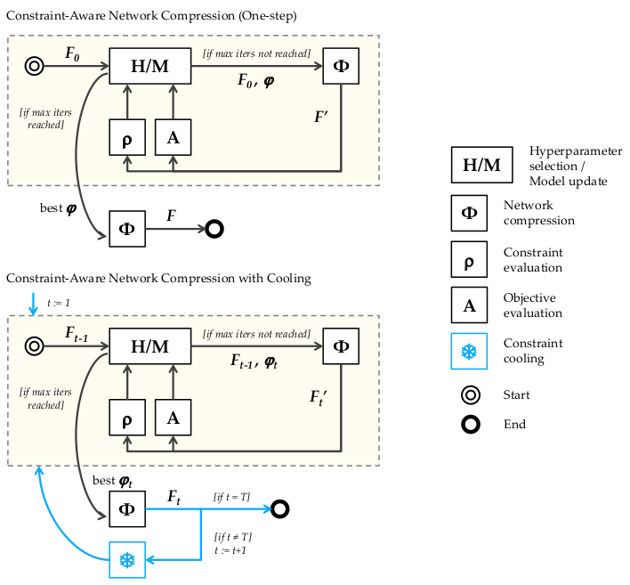

# Constraint-Aware Deep Neural Network Compression
Given a real-time operational constraints, this library can
automatically compress the network to satisfy the constraint while
preserving the accuracy. This library is built on top of[SkimCaffe](https://github.com/IntelLabs/SkimCaffe),
which has implemented direct sparse convolution operations and has an effective
speedup given an input sparse network. This framework can be applied to
different constraint types(latency, memory size), different network(Alexnet,
Resnet, Googlenet) and different datasets(ImagenNet, DTD).

For more technical details, please refer to the paper [Constraint-Aware Deep Neural Network
Compression](http://changan.io/constraint_aware_compression.pdf).



## Usage
1. First follow the build-up instructions in [SkimCaffe](https://github.com/IntelLabs/SkimCaffe)
to build SkimCaffe.
2. Modify the cfp.config file to adapt to your own need(constraint values).
3. Run training in root directory:
```
python2 main.py
```
4. To visualize the training result, specify the output directory:
```
python2 pruning/visualize_cbo_results.py [OUTPUT_DIR]
```

## Citation
If you use this code or ideas from the paper for your research, please cite our paper:
```
@InProceedings{Chen_2018_ECCV,
author = {Chen, Changan and Tung, Frederick and Vedula, Naveen and Mori, Greg},
title = {Constraint-Aware Deep Neural Network Compression},
booktitle = {The European Conference on Computer Vision (ECCV)},
month = {September},
year = {2018}
}
```